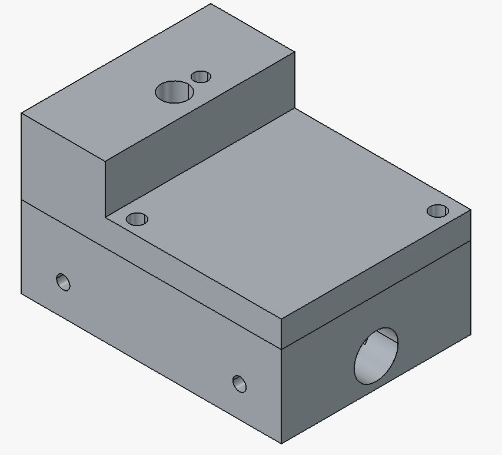
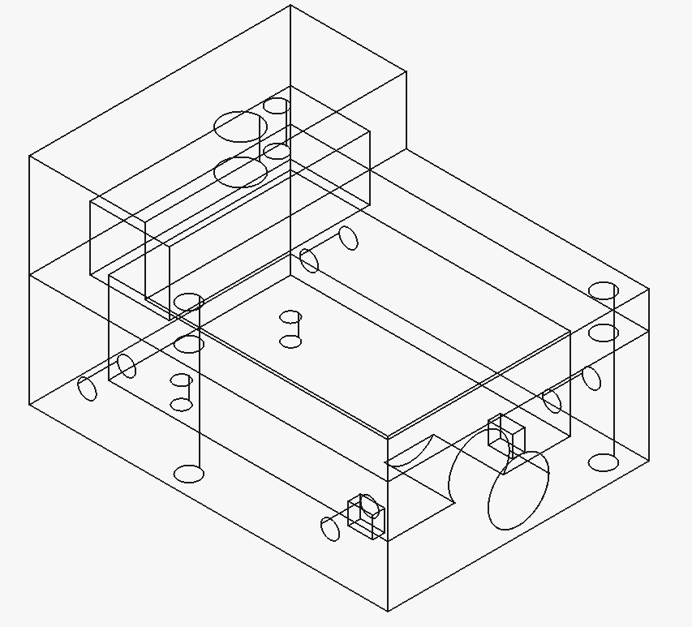

# FotosensorEnclosure

Esta pasta contém o design da carcaça (enclosure) para o fotosensor do Sistema de Controle de Fluxo.

## Arquivos

- `FotosensorEnclosure.FCStd`: Arquivo de projeto do FreeCAD contendo o design 3D da carcaça.
- `fotosensor-enclosure-normal.png`: Imagem de referência do design da carcaça.
- `fotosensor-enclosure-wireframe.png`: Imagem de referência do design da carcaça em wireframe.
- `FotosensorEnclosure-Body-Bottom.obj`: Modelo 3D da parte inferior da carcaça (formato OBJ).
- `FotosensorEnclosure-Body-Top.obj`: Modelo 3D da parte superior da carcaça (formato OBJ).

## Imagem de Referência

## Descrição

A carcaça do fotosensor é projetada para proteger o sensor óptico utilizado na detecção de fluxo no sistema de controle. O design inclui partes superior e inferior para facilitar a montagem e manutenção.

## Montagem

Para montar a carcaça, utilize 2 parafusos M3x10 ou de comprimento superior, junto com as respectivas porcas de fusão térmica (insertos térmicos).