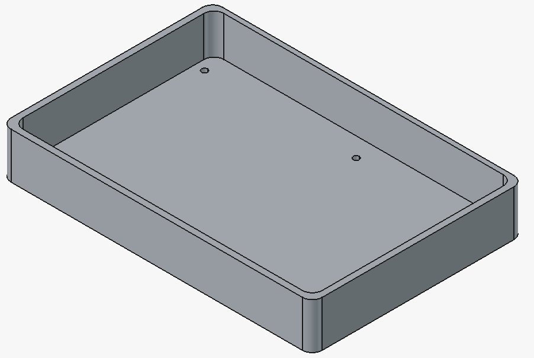
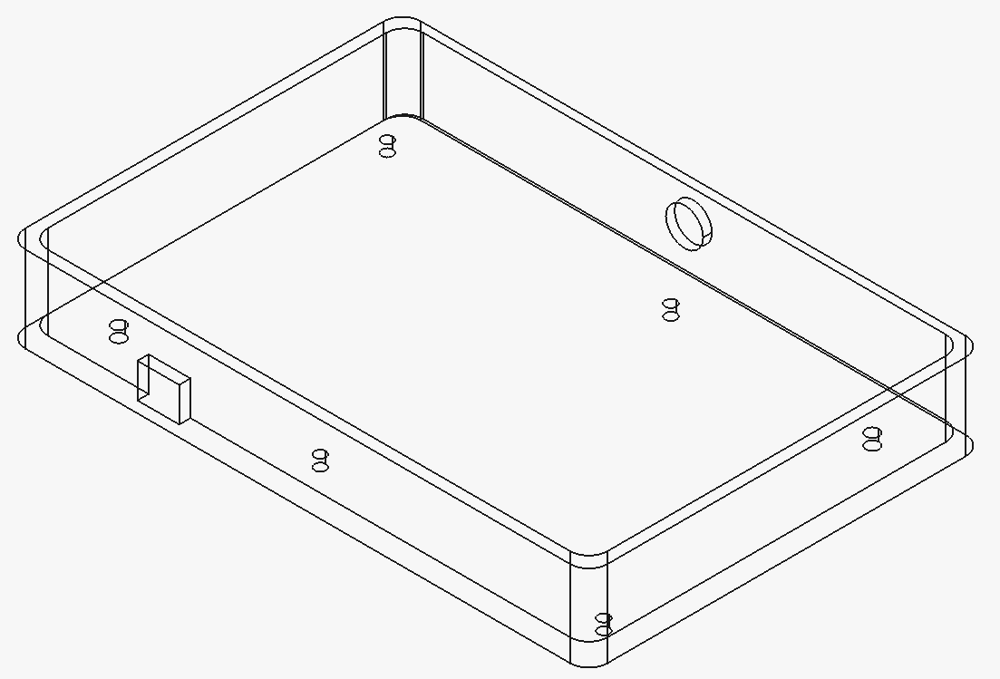
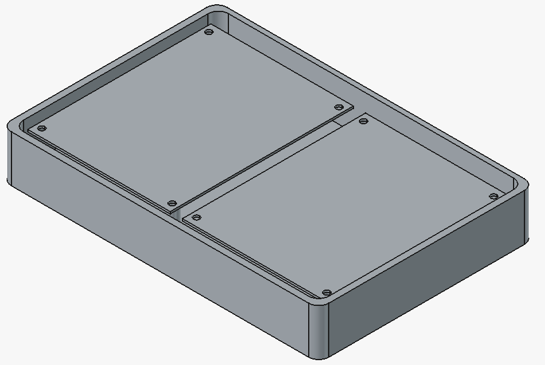
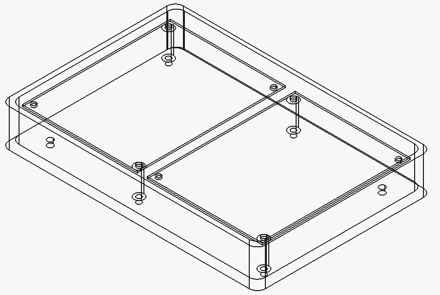
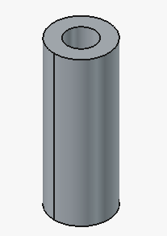

# MainboardEnclosure

Esta pasta contém o design da carcaça (enclosure) para a placa principal (mainboard) do Sistema de Controle de Fluxo.

## Arquivos

- `MainboardEnclosure.FCStd`: Arquivo de projeto do FreeCAD contendo o design 3D da carcaça.
- `MainboardEnclosure.obj`: Modelo 3D da carcaça (formato OBJ).
- `Spacer.obj`: Modelo 3D do espaçador (spacer) (formato OBJ).
- `assembly-normal.png`: Imagem da montagem em vista normal.
- `assembly-wireframe.png`: Imagem da montagem em vista wireframe.
- `mainboard-enclosure-normal.png`: Imagem da carcaça em vista normal.
- `mainboard-enclosure-wireframe.png`: Imagem da carcaça em vista wireframe.
- `spacer.png`: Imagem do espaçador.

## Imagens de Referência

### Carcaça da Placa Principal

### Montagem

### Espaçador

## Descrição

A carcaça da placa principal é projetada para proteger e fixar a placa de circuito principal do sistema de controle de fluxo. Inclui um espaçador para isolamento e montagem adequada.

## Montagem

Para montar a carcaça, utilize 4 parafusos M3.5x20. Os parafusos criam rosca diretamente no plástico, não sendo necessários insertos ou porcas adicionais.