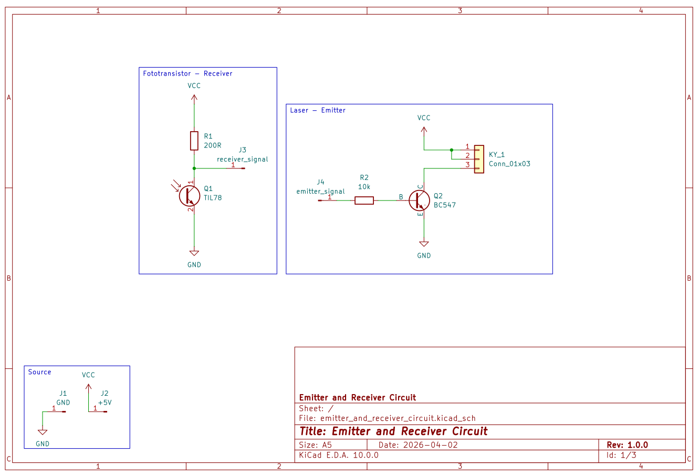
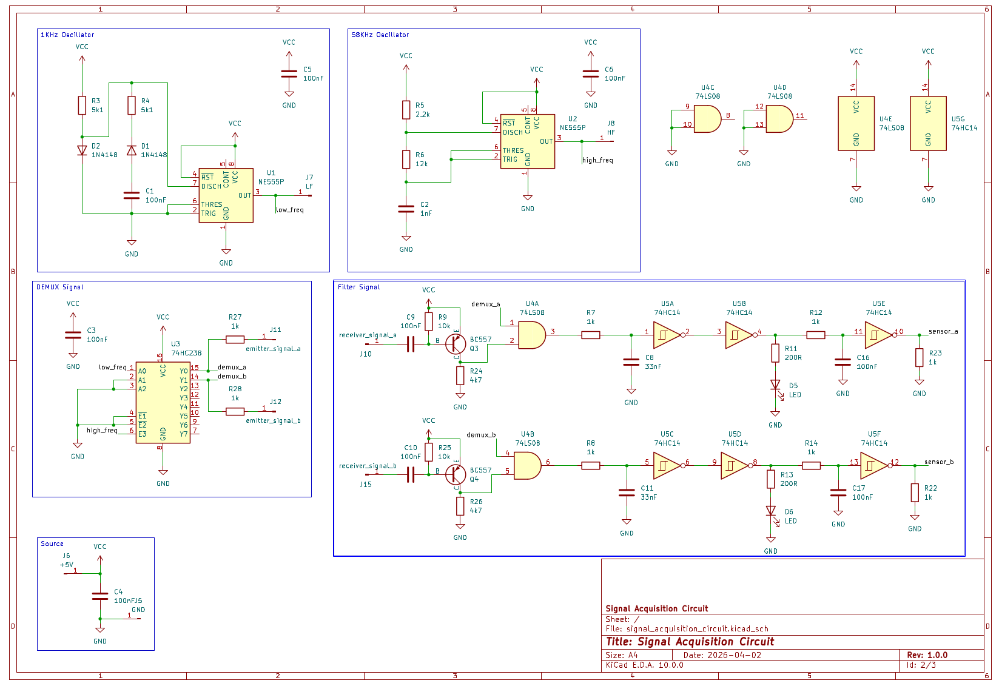
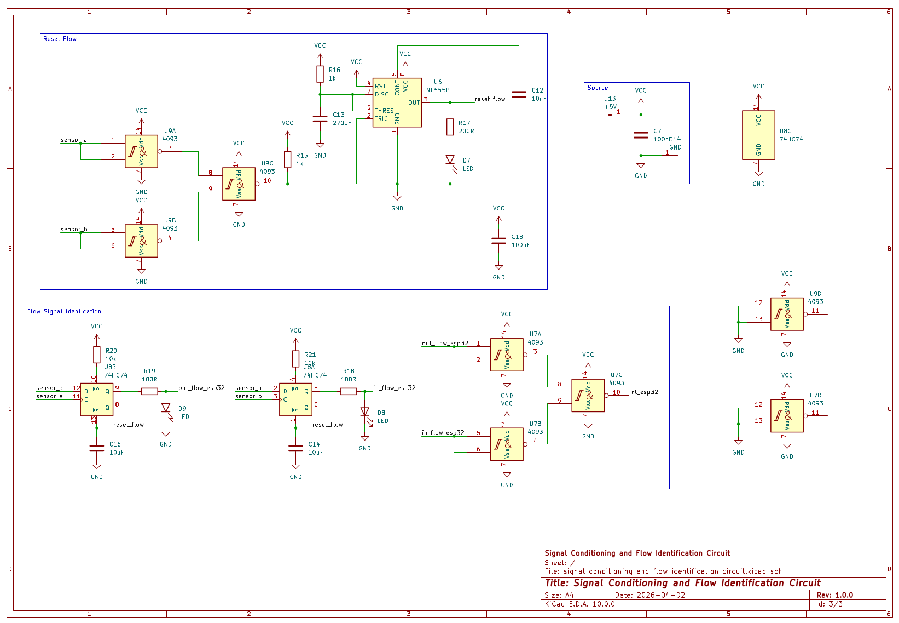

# Projeto Integrador V - Monitor de Fluxo de Pessoas

Este diretório contém a documentação técnica, os esquemáticos eletrônicos e a lista de materiais (BOM) para o sistema de monitoramento de fluxo.

## 📂 Conteúdo do Diretório

O projeto é composto por três estágios principais, detalhados nos arquivos de imagem abaixo:

1.  **Emissor e Receptor (`emitter_and_receiver_schematic.png`)**:
    * Circuito de acionamento do diodo laser via transistor **BC547**.
    * Recepção de sinal via fototransistor **TIL78** com resistor de pull-up para gerar o sinal de saída.
2.  **Aquisição de Sinal (`signal_acquisition_schematic.png`)**:
    * Osciladores baseados no **NE555** para modulação em frequências distintas.
    * Filtragem ativa e demultiplexação utilizando portas **74LS08** e **74HC238** para garantir a imunidade a ruídos luminosos.
3.  **Condicionamento e Identificação de Fluxo (`signal_conditioning_and_flow_identification_schematic.png`)**:
    * Lógica de detecção de sentido (In/Out) utilizando Flip-Flops **74HC74**.
    * Tratamento de sinal com portas NAND Schmitt Trigger **4093** para debouncing e interface limpa com microcontroladores.
4.  **Processamento e Servidor (`processing-server-esp32-circuit.png`)**:
    * Receber o sinal de sentido (In-Flow/Out-Flow) nas portas do ESP32
    * Utilização de firmware para o sistema processamento e disponbilidade dos dados via web

    
    
    

    
    

---

---

### 📑 Documentação em PDF

Para visualizar o projeto completo em alta resolução, acesse o link abaixo:
👉 **[Clique aqui para abrir o PDF do Esquemático](flow-control-system_schematic.pdf)**

---

## 📦 Lista de Componentes Detalhada (BOM)

Lista baseada no projeto de hardware, excluindo conectores de barra de pinos (Terminais JX).

### 1. Módulo Emitter e Receiver de Sinal (Duplicado)
| Categoria | Componente / Valor | Detalhes Técnicos | Referências | Qtd |
| :--- | :--- | :--- | :--- | :--- |
| **Sensores** | **TIL78** | Fototransistor NPN | Q1 | 02 |
| **Semicond.** | **BC547** | Transistor NPN | Q2 | 02 |
| **Resistor** | **200 $\Omega$** | Filme de Carbono | R1 | 02 |
| **Resistor** | **10k $\Omega$** | Filme de Carbono | R2 | 02 |
| **Conector** | **Conn_01x03** | Interface para Módulo Laser | KY_1 | 02 |

### 2. Módulo de Aquisição e Lógica de Sinal
| Categoria | Componente / Valor | Detalhes Técnicos | Referências | Qtd |
| :--- | :--- | :--- | :--- | :--- |
| **CIs** | **NE555P** | Temporizador / Oscilador | U1, U2 | 02 |
| **CIs** | **74HC238** | Demultiplexador 3-para-8 | U3 | 01 |
| **CIs** | **74LS08** | Quad 2-Input AND Gate | U4 | 01 |
| **CIs** | **74HC14** | Hex Inverting Schmitt Trigger | U5 | 01 |
| **Semicond.** | **BC557** | Transistor PNP | Q3, Q4 | 02 |
| **Semicond.** | **1N4148** | Diodo de sinal rápido | D1, D2 | 02 |
| **Indicador** | **LED** | Sinalização de Feixe/Status | D5, D6 | 02 |
| **Capacitor** | **100nF** | Cerâmico (Desacoplamento) | C1, C3-C6, C9, C10, C16, C17 | 09 |
| **Capacitor** | **33nF** | Cerâmico / Poliéster | C8, C11 | 02 |
| **Capacitor** | **1nF** | Cerâmico | C2 | 01 |
| **Resistor** | **12k $\Omega$** | Filme de Carbono | R6 | 01 |
| **Resistor** | **10k $\Omega$** | Filme de Carbono | R9, R25 | 02 |
| **Resistor** | **5k1 $\Omega$** | Filme de Carbono | R3, R4 | 02 |
| **Resistor** | **4k7 $\Omega$** | Filme de Carbono | R24, R25 | 02 |
| **Resistor** | **2k2 $\Omega$** | Filme de Carbono | R5 | 01 |
| **Resistor** | **1k $\Omega$** | Filme de Carbono | R7, R8, R12, R14, R27, R28 | 06 |
| **Resistor** | **200 $\Omega$** | Filme de Carbono | R11, R13 | 02 |

### 3. Condicionamento e Identificação de Fluxo
| Categoria | Componente / Valor | Detalhes Técnicos | Referências | Qtd |
| :--- | :--- | :--- | :--- | :--- |
| **CIs** | **NE555P** | Temporizador / Oscilador | U6 | 01 |
| **CIs** | **CD4093** | Quad 2-Input NAND Schmitt Trigger | U7, U9 | 02 |
| **CIs** | **74HC74** | Dual D-Type Flip-Flop | U8 | 01 |
| **Indicador** | **LED** | Sinalização de Feixe/Status | D7, D8, D9 | 03 |
| **Resistor** | **10k $\Omega$** | Filme de Carbono | R20, R21 | 02 |
| **Resistor** | **1k $\Omega$** | Limitação de corrente LED | R15, R16 | 02 |
| **Resistor** | **200 $\Omega$** | Filme de Carbono | R17 | 01 |
| **Resistor** | **100 $\Omega$** | Limitação de corrente LED | R18, R19 | 02 |
| **Capacitor** | **270uF** | Eletrolítico (Filtro/Reset) | C13 | 01 |
| **Capacitor** | **10uF** | Eletrolítico (Estabilização) | C14, C15 | 02 |
| **Capacitor** | **100nF** | Cerâmico (Desacoplamento) | C7, C18 | 02 |
| **Capacitor** | **10nF** | Cerâmico (Desacoplamento) | C12 | 01 |

### 4. Processamento e Servidor (IoT)
Módulo responsável pela leitura dos pulsos lógicos, processamento dos dados de contagem e transmissão via rede.

| Categoria | Componente / Valor | Detalhes Técnicos | Qtd |
| :--- | :--- | :--- | :--- |
| **MCU** | **ESP32** | Microcontrolador com Wi-Fi/Bluetooth | 01 |
| **Resistor** | **20k $\Omega$** | Divisor de tensão / Condicionamento | 03 |
| **Resistor** | **10k $\Omega$** | Pull-up / Pull-down de interface | 03 |
| **Capacitor** | **100nF** | Cerâmico (Desacoplamento ESP32) | 01 |

---
*Nota: Os esquemáticos foram desenvolvidos em KiCad. Terminais de alimentação e pontos de teste (J1-J14) estão presentes nos desenhos técnicos, mas foram omitidos desta lista de componentes para simplificação da compra de materiais.*