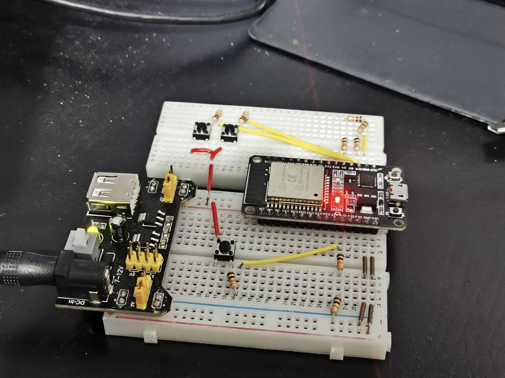
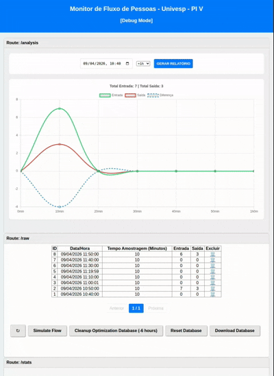

# 🚀 Monitor de Fluxo de Pessoas - Univesp - PI V

[](https://github.com/seu-usuario)
[](LICENSE)

> [Sistema que verifica o fluxo de pessoas em um determinado local, registrando a entrada e a saída]

---

## 🔗 Integrantes do Grupo

|               Nome Completo               |    NA    |
| ----------------------------------------- | -------- |
| Livia Santos Paes                         | 2216192  |
| Lucas Campos Achcar                       | 23207401 |
| Luiz Fernando Sales Lemos                 | 2226810  |
| Maria Francisca Bezerra da Conceição      | 2010316  |

---

## 📌 Sumário

* [Sobre o Projeto](#-sobre-o-projeto)
* [Tecnologias e Ferramentas](#-tecnologias-e-ferramentas)
* [Progresso do Desenvolvimento](#-progresso-do-desenvolvimento)
* [Estrutura do Projeto](#-estrutura-do-projeto)
* [Previa de Desenvolvimento](#-previa-de-desenvolvimento)

> 💡 **README Extra:**
> - [README Firmware](./Firmware/README.md)
> - [README Building Blocks](<./Building Blocks/README.md>)
> - [README Kicad Schematic](<./Kicad Schematic/README.md>)

---

## 🧩 Sobre o Projeto

O **Monitor de Fluxo de Pessoas** é uma solução de sistemas embarcados projetada para automatizar a contagem e o monitoramento de tráfego em ambientes fechados de forma autônoma e de baixo custo. O sistema utiliza um par de sensores ópticos infravermelhos para detectar não apenas a presença, mas a **direcionalidade do movimento**, permitindo distinguir com precisão entre entradas e saídas.

Diferente de soluções dependentes de nuvem, este projeto foca em **Edge Computing** (Processamento na Borda), onde a lógica de identificação de fluxo e o armazenamento dos registros ocorrem integralmente dentro do microcontrolador ESP32, garantindo privacidade e operabilidade mesmo sem conexão constante com a internet.

### 🧠 Diagrama de Blocos do Sistema


### ⚙️ Principais Funcionalidades

| Recurso | Descrição |
| :--- | :--- |
| **Detecção Direcional** | Circuito de tratamento de sinais que identifica o sentido do fluxo através do acionamento sequencial dos sensores. |
| **Condicionamento** | Circuito projetado para minimizar ruídos e falsos positivos, garantindo que a contagem reflita o fluxo real. |
| **Persistência Local** | Utilização da biblioteca **SQLite** para armazenamento robusto de logs no sistema de arquivos do ESP32, evitando perda de dados. |
| **Interface Web** | Servidor HTTP nativo que disponibiliza uma página para consulta em tempo real e visualização do histórico de acessos. |

---

## 🛠 Tecnologias e Ferramentas
* **Firmware:** [C++ | Arduino | PlatformIO]
* **Microcontrolador:** [ESP32 | ESP8266]
* **Linguagens:** [C++]
* **Banco de Dados:** [SQLite]
* **Simulações:** [SimulIDE]
* **CAD:** [Kicad e DIY Layout Creator]

## 🔧 Progresso do Desenvolvimento
|Status | Descrição |
| :--- | :--- |
| ✅ Concluído | Idealização do Projeto |
| ✅ Concluído | Prototipação do Projeto utilizando CAD (Computer-Aided Design) |
| ✅ Concluído | Desenvolvimento do Firmware |
| ✅ Concluído | Alterações e Correções do Firmware |
| ✅ Concluído | Testes do Firmware para Identificação de Bugs e Leak de Memória |
| ✅ Concluído  | Projeto e Prototipagem do Fotosensor |
| ✅ Concluído | Desenvolvimento da Enclusure para o Fotosensor |
| ✅ Concluído | Desenvolvimento do Schematic via Kicad |
| 🟡 Desenvolvimento | Desenho dos Circuitos para Placa PadBoard usando a ferramenta DIY Layout Creator |
| ✅ Concluído | Teste do Circuito de Processamento na Protoboard|
| ✅ Concluído | Teste do Circuito de Aquisição de Sinal na Protoboard |
| 🟡 Desenvolvimento | Teste do Circuito de Condicionamento, Identificação de Fluxo na Protoboard|
| 🔴 Pendente | Desenvolvimento do Circuito de Aquisição de Sinal na Placa PadBoard |
| 🔴 Pendente | Desenvolvimento do Circuito de Condicionamento, Identificação de Fluxo e Processamento na Placa PadBoard|

<!--
| ✅ Concluído | Text |
| 🟡 Desenvolvimento | Text |
| 🔴 Pendente | Text |
-->

## 📂 Estrutura do Projeto
Para facilitar a navegação, o projeto está dividido da seguinte forma:

```text
└── README.md                                           # [Detalhes do Projeto](./README.md)
├── Building Blocks/                                    # Prototipagem Geral do Sistema via CAD (SimulIDE)
    └── Processing e Server/                                    # Prototipação do ESP32 como WebServer e Processamento de Dados
    └── Emitter and Receiver                                    # Prototipação do Circuito do Fotosensor
    └── Signal Acquisition Circuit                              # Prototipação do Circuito de Aquisição de Sinais
    └── Signal Conditioning and Flow Identification Circuit     # Prototipação do Circuito de Condicionamento e Identificação de Fluxo
    └── README.md                                               # [Detalhes do Building Blocks](./Building Blocks/README.md)
├── Firmware/                                           # Código Fonte do Firmware do ESP32, Contém o WebServer e o Processamento de Sinais
    └── README.md                                               # [Detalhes do Firmware](./Firmware/README.md)
├── Hardware - Aspecto Geral (Diagrama de Blocos)/      # Idealização e Diagramação do Projeto Completo
├── Brainstorm/                                         # Brainstorm da Ideia Inicial
├── Previa/                                             # Imagens e Animações de Previa do Projeto
├── LTSpice/                                            # Simulações feitas via LTSpice para Auxilio do Desenvolvimento e Ajustes do Protótipo
├── Enclosure/                                          # Projeto das Cases Feito via FreeCAD
    └── FotosensorEnclosure                                     # Projeto da Case do Fotosensor feito em FreeCAD
├── Kicad Schematic                                     # Schematic do Circuito Feito via Kicad
```

## 🚀 Previa de Desenvolvimento

* ### Prototipo do Hardware para o Desenvolvimento do Firmware no ESP32



> 💡 **Detalhes da Placa de Teste:**
> - Os dois botões na parte de cima representam a entrada e a saída do fluxo.
> - O botão na parte de baixo representa a interrupção com detecção por borda de descida.

* ### Previa do 'Web Server' do Firmware



> 💡 **Detalhes do WebServer da Firmware:**
> - Servidor rodando diretamente no ESP32 - Edge Computing (Computador de Borda)
> - Gráfico para visualização dos dados em intervalos de horas
> - Planilha contendo os dados brutos (raw data)
> - Dashboard responsivo para celular e desktop.
> - Atualização em tempo real dos registros armazenados no SQLite.
> - Dashboard possui um sistema de stats para avaliação de desempenho do ESP32

